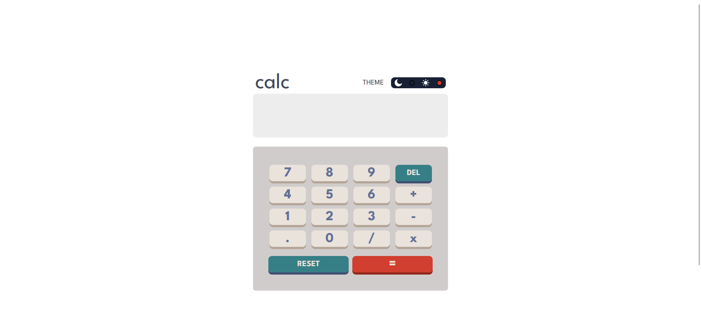
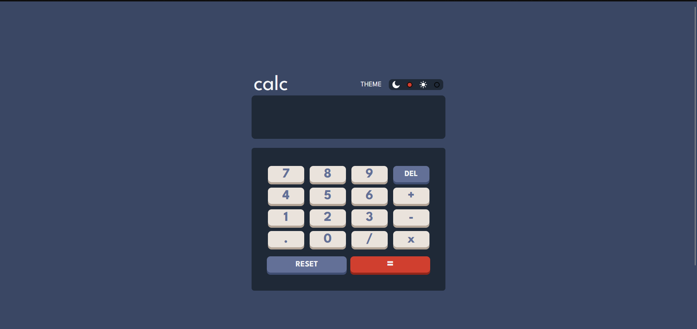
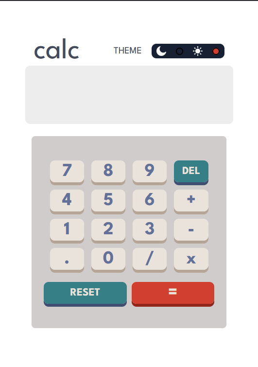
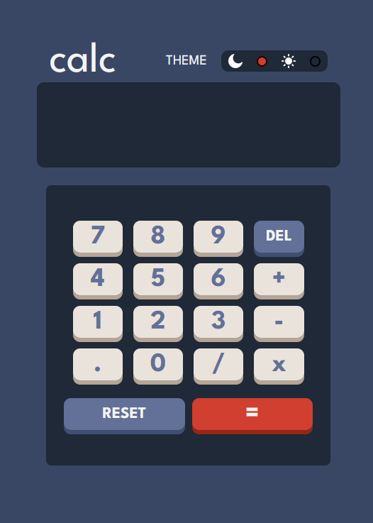

# What were used in this project?

For this project / assignment; both React (Vite) and Tailwind were utilized in order to
create a functioning calculator. The following calculator also is funcitonal on all sort of devices.

# Dark Mode

Wanted to take this challenge a bit further and went and designed a dark mode for the website.
Again this mode is functional for all devices.

# Screenshots

### Light mode for PC

### Dark Mode for PC

### Light mode for Mobile

### Dark Mode for Mobile

Some features that I'd add. Allowing users to input the numbers via keyboard.
